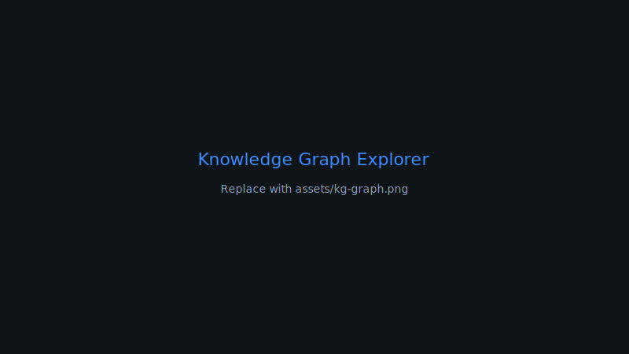
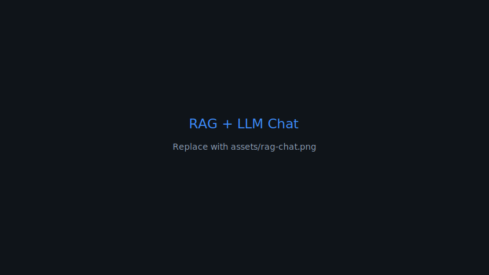
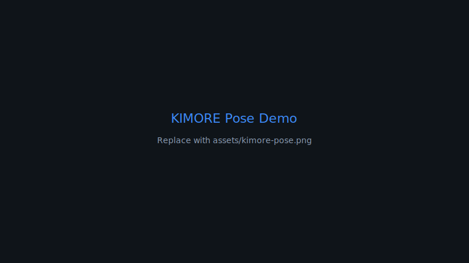
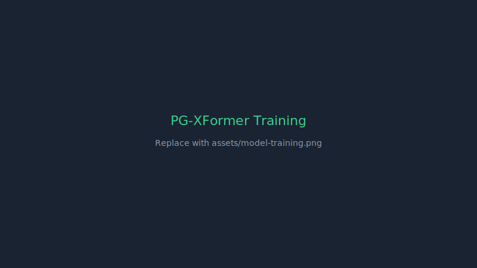
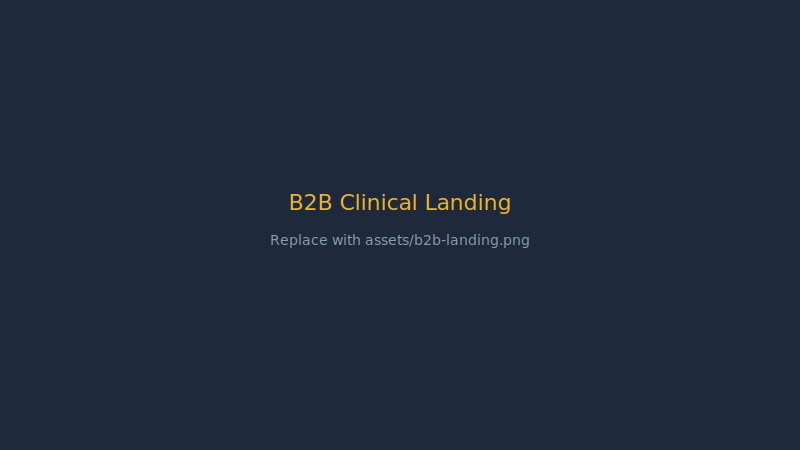
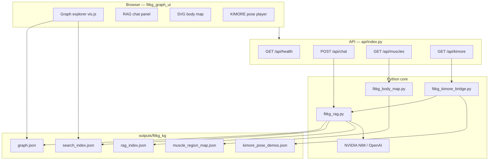

# PG-XFormer & FitKG Explorer: Home Physiotherapy
Monitoring with Knowledge-Grounded AI


 


<p align="center">


  


</p>


 


This repository contains the **physio** research stack:
**PG-XFormer** (pose-guided cross-modal exercise classification) and **FitKG
Explorer** (interactive fitness knowledge graph with RAG + LLM chat, body map,
and KIMORE clinical demos).


[](https://physio-x2pm.vercel.app/)


[](https://github.com/astral-fate/physio)


[](https://colab.research.google.com/drive/1E64eBfdd6kSDk4Rt4GPmH4todzeCrJcg?usp=sharing)


[](https://github.com/NYN921/FitKG-CN)


## Platform interface previews & gallery

Explore the live **FitKG Explorer** workspace and related
platform surfaces. *Replace placeholder SVGs in `assets/` with your screenshots
(`kg-graph.png`, `rag-chat.png`, etc.) and update the `src` paths below.*
<table width="100%">

  <tr>

    <td
width="50%" valign="top" align="center">

      <h4>FitKG
Knowledge Graph (8k+ nodes)</h4>

      <a
href="https://physio-tau-eight.vercel.app/"></a>

      <p
align="left"><small>Interactive vis.js subgraph — English
search over FitKG-CN entities, relations, and 2-hop
neighborhoods.</small></p>

    </td>

    <td
width="50%" valign="top" align="center">

      <h4>RAG +
LLM Assistant</h4>


      <a
href="https://physio-tau-eight.vercel.app/"></a>


      <p
align="left"><small>Grounded chat over 11k+ passages —
optional NVIDIA NIM / OpenAI synthesis with graph + body-map
highlights.</small></p>


    </td>


  </tr>


  <tr>


    <td
width="50%" valign="top" align="center">


     
<h4>Anatomical Body Map</h4>


      <a
href="https://physio-tau-eight.vercel.app/"></a>


      <p
align="left"><small>22-region anterior/posterior SVG —
muscles highlight from RAG retrieval and graph node
selection.</small></p>


    </td>


    <td
width="50%" valign="top" align="center">


      <h4>KIMORE
Clinical Pose Demo</h4>


      <a
href="https://physio-tau-eight.vercel.app/"></a>


      <p
align="left"><small>COCO-17 synthetic animations for 5 rehab
classes with FitKG muscle context and therapist-style
cues.</small></p>


    </td>


  </tr>


  <tr>


    <td
width="50%" valign="top" align="center">


     
<h4>PG-XFormer Model Training</h4>


      <a
href="https://colab.research.google.com/drive/1E64eBfdd6kSDk4Rt4GPmH4todzeCrJcg?usp=sharing"></a>


      <p
align="left"><small>Sim-to-real pipeline: pretrain on
InfiniteRep synthetic data, fine-tune on KIMORE, evaluate on
UI-PRMD.</small></p>


    </td>


    <td
width="50%" valign="top" align="center">


      <h4>B2B
Clinical Landing Page</h4>


      <a
href="https://faqarati-403347311270.europe-west2.run.app/"></a>


      <p
align="left"><small>Product-facing clinical landing for
physiotherapy / rehab deployment scenarios.</small></p>


    </td>


  </tr>


</table>


## 1. The Problem
Roughly half of all physical therapy episodes are partly or wholly home-based. While adherence to prescribed exercises improves recovery outcomes, unsupervised patients frequently commit form errors that reduce rehabilitative benefits and risk re-injury.
Current computational solutions face two critical roadblocks:
 * **The Sim-to-Real Gap:** Models rely heavily on synthetic or laboratory data, masking clinical translation failures.
 * **The Explainability Gap:** Existing systems stop at basic classification or arbitrary quality scoring, failing to provide actionable, natural-language feedback grounded in structured medical knowledge.

 * 
## 2. The Solution
**physio** delivers a complete, end-to-end clinical application bridging cutting-edge AI research with a robust user interface.
The system operates across two main pillars:
 * **The Intelligence Layer (PG-XFormer):** A deep multimodal neural network that monitors and classifies physical therapy exercises using Pose-Retrieved Synthetic Appearance (PRSA) to bridge the gap between synthetic pretraining and clinical deployment.
 * **The Context Layer (FitKG Explorer):** A rich, interactive web application featuring a knowledge graph, RAG-powered LLM chat, and visual body maps to explain exactly *which* muscles are engaged and provide safe, grounded cues.
## 3. Platform Links & Previews
| Platform | Description | Link |
|---|---|---|
| **Knowledge Graph** | FitKG Explorer — graph search, RAG chat, body map | physio-tau-eight.vercel.app |
| **Model Training** | PG-XFormer Colab pipeline (InfiniteRep → KIMORE → UI-PRMD) | Google Colab |
| **B2B Landing Page** | Clinical / product landing (Faqarati) | faqarati.run.app |
## 4. Deep Learning Research: PG-XFormer
PG-XFormer couples a CTR-GCN skeleton encoder with a VideoMAE-base video encoder using bottleneck cross-attention fusion.
### Core Innovations
 * **Pose-Retrieved Synthetic Appearance (PRSA):** Overcomes the lack of diverse real-patient visual data by mapping clinical patient clips to the nearest synthetic recordings using Dynamic Time Warping (DTW) on normalized poses.
 * **Agentic Feedback Layer:** Extracts kinematic features (joint angles, range of motion, symmetry) and processes them through a per-class skeleton Variational Autoencoder (VAE) to score anomalies.
 * **Safety-Guarded LLM:** Generates natural-language corrective cues based entirely on a structured kinematic report, escalating warnings or halting sessions if critical form errors occur across consecutive repetitions.
### Training Objective
The total training objective of the system utilizes cross-entropy, InfoNCE alignment, and Maximum Mean Discrepancy (MMD) to align synthetic and real video features during fine-tuning:
### Clinical Validation & Results
We conducted a reproducible sim-to-real evaluation protocol utilizing the clinical KIMORE dataset alongside the large-scale InfiniteRep corpus. A clinical study involving five licensed physiotherapists rated the system's generated cues with a **clinical accuracy of 4.4/5** and a **safety rating of 4.7/5**, with a hallucination rate of only 2%.
| Model Architecture | Macro-F1 Score | Accuracy |
|---|---|---|
| **PG-XFormer (Multimodal Concat)** | **89.1±1.7%** | **89.2±1.9%** |
| CTR-GCN-only (Skeleton Stream) | 86.8±3.5% | 87.1±3.4% |
| CNN+LSTM Concat (M0 Baseline) | 80.6±6.0% | 81.5±6.0% |
| 2-layer BiLSTM | 65.0±4.7% | 69.3±4.8% |
## 5. Web Interface: FitKG Explorer & RAG
The FitKG Explorer provides the necessary context and explainability for both clinicians and patients. The LLM is instructed to answer **only** from retrieved context, preventing medical hallucination.
### Key Components
 * **Graph Explorer:** Interactive vis.js subgraph allowing English search over 8k+ FitKG-CN entities, relations, and 2-hop neighborhoods.
 * **RAG + LLM Assistant:** Grounded chat over 11k+ medical passages, utilizing NVIDIA NIM or OpenAI for synthesis alongside graph and body-map highlights.
 * **Anatomical Body Map:** 22-region anterior/posterior SVG map where muscles dynamically highlight based on RAG retrieval and graph node selection.
 * **KIMORE Clinical Pose Demo:** Playable COCO-17 synthetic animations for 5 clinical rehab classes, paired with FitKG muscle context and therapist-style cues.
### Knowledge Graph Scale
| Metric | Value |
|---|---|
| Documents | 11,544 |
| Unique entities (nodes) | 8,043 |
| Unique relations (edges) | 13,510 |
| Entity mentions | 26,494 |
## 6. System Architecture

## 7. Technology Stack
| Category | Technology |
|---|---|
| **Deep Learning** | PyTorch 2.4, Hugging Face transformers & peft |
| **Vision/Pose Models** | VideoMAE-base, CTR-GCN |
| **Knowledge Base** | FitKG-CN (Chinese fitness KG, SpERT extraction) |
| **Graph UI & Body Map** | HTML/CSS/JS, vis-network, Custom SVG (fitkg_body_svg.py) |
| **LLM & Agent** | NVIDIA NIM API (qwen3-next-80b), Anthropic API (Claude Sonnet) |
| **Infrastructure** | Vercel Serverless, Python http.server, ngrok |
## 8. Deployment & Local Development
### Vercel (Recommended)
 1. Import astral-fate/physio at vercel.com/new
 2. Add NVIDIA_API_KEY in Project → Settings → Environment Variables → **Redeploy**
 3. Open your Vercel URL.
### Local Development
```powershell
# Install dependencies
pip install -r requirements.txt

# Set environment variables
copy .env.example .env    # add NVIDIA_API_KEY inside

# Run local server
.\run_fitkg.ps1

```
Open: http://127.0.0.1:8766/fitkg_graph_ui/index.html
### Environment Variables (.env)
```env
# NVIDIA NIM (recommended)
NVIDIA_API_KEY=your_key
NVIDIA_BASE_URL=https://integrate.api.nvidia.com/v1
FITKG_CHAT_MODEL=qwen/qwen3-next-80b-a3b-instruct
FITKG_LLM_TEMPERATURE=0.6
FITKG_LLM_TOP_P=0.7
FITKG_LLM_MAX_TOKENS=1024

```
## 9. API Reference
Base URL: **https://physio-x2pm.vercel.app** (local: http://127.0.0.1:8766)
| Endpoint | Method | Parameters / body | Response |
|---|---|---|---|
| /api/health | GET | — | { server, ok, rag_index, graph, llm, llm_provider } |
| /api/chat | POST | { "query": "squat muscles", "use_llm": true } | { reply, nodes, regions, muscle_info, passage_count } |
| /api/muscles | GET | ?node_id=<id> | { regions, muscles, … } |
| /api/kimore/demo | GET | ?class=squat | Pose sequence, edges, FitKG context, cue |
## License & Attribution
 * **FitKG-CN** knowledge graph: see NYN921/FitKG-CN.
 * **KIMORE** exercise classes: clinical rehabilitation benchmark.
 * **Application code** in this repository: developed for the physio / MIUA research project.
